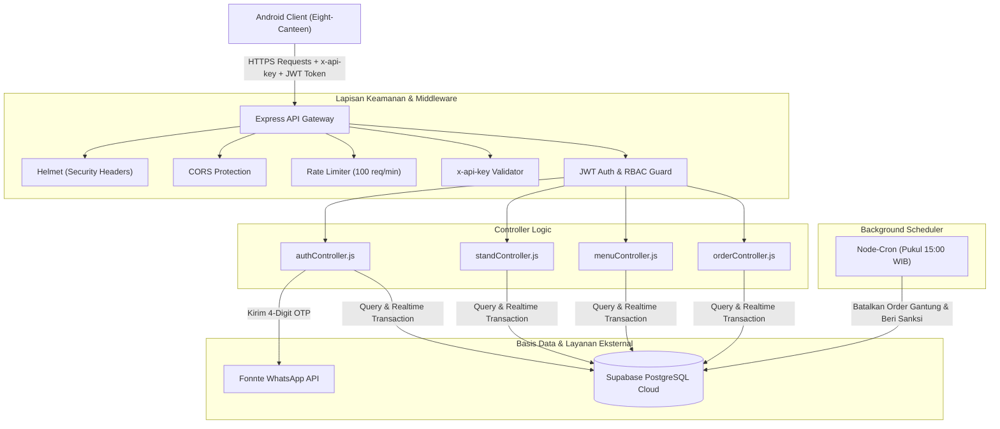
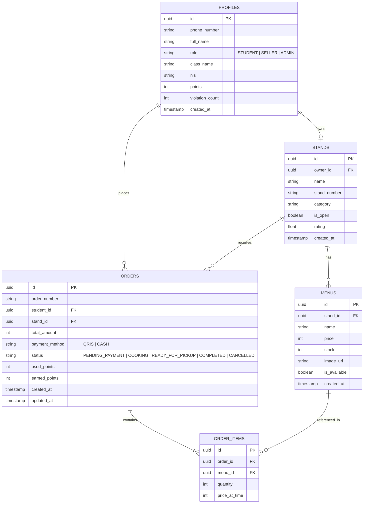

# Eight Canteen - Backend RESTful API (E-Kantin SMKN 8 Jakarta)

<p align="center">
  <strong>High-Performance RESTful API & Real-time Services untuk Ekosistem Kantin Digital SMKN 8 Jakarta</strong>
</p>

<p align="center">
  <a href="https://nodejs.org/"></a>
  <a href="https://expressjs.com/"></a>
  <a href="https://supabase.com/"></a>
  <a href="https://jwt.io/"></a>
  <a href="https://fonnte.com/"></a>
  
</p>

---

## Repository Terhubung

Layanan backend ini dirancang khusus untuk menjadi *backend service* utama bagi aplikasi mobile Android:
* **Frontend Mobile (Android)**: [Eight-Canteen (GitHub)](https://github.com/Papi0404/Eight-Canteen.git)
* **Backend API (Express & Supabase)**: [backend-kantin-mobile (GitHub)](https://github.com/alviangalen/backend-kantin-mobile.git)
* **Instansi**: SMKN 8 Jakarta

---

## Daftar Isi

1. [Tentang Layanan Backend](#-tentang-layanan-backend)
2. [Arsitektur Sistem & Alur Data](#️-arsitektur-sistem--alur-data)
3. [Fitur Utama](#-fitur-utama)
4. [Struktur Direktori](#-struktur-direktori)
5. [Spesifikasi & Dokumentasi API](#-spesifikasi--dokumentasi-api)
   - [Header Wajib](#header-wajib)
   - [Format Respon Standar](#format-respon-standar)
   - [1. Health Check](#1-health-check)
   - [2. Autentikasi & OTP (/api/v1/auth)](#2-autentikasi--otp-apiv1auth)
   - [3. Profil Pengguna (/api/v1/users)](#3-profil-pengguna-apiv1users)
   - [4. Stand & Toko Kantin (/api/v1/stands & /api/v1/seller)](#4-stand--toko-kantin-apiv1stands--apiv1seller)
   - [5. Katalog Menu & Stok (/api/v1/menus)](#5-katalog-menu--stok-apiv1menus)
   - [6. Pesanan & Checkout (/api/v1/orders)](#6-pesanan--checkout-apiv1orders)
6. [Integrasi dengan Frontend Android](#-integrasi-dengan-frontend-android)
7. [Instalasi & Pengaturan Lokal](#️-instalasi--pengaturan-lokal)
8. [Konfigurasi Environment (.env)](#-konfigurasi-environment-env)
9. [Skema Database (Supabase)](#-skema-database-supabase)
10. [Background Cron Job (Patroli Penalti)](#-background-cron-job-patroli-penalti)
11. [Deployment ke Cloud (Render)](#️-deployment-ke-cloud-render)
12. [Tim Pengembang](#-tim-pengembang)
13. [Lisensi](#-lisensi)

---

## Tentang Layanan Backend

**Eight Canteen Backend API** adalah web service modern berbasis **Node.js** dan **Express.js (v5)** yang terintegrasi dengan **Supabase PostgreSQL** sebagai database utama dan **Fonnte Gateway** untuk pengiriman verifikasi OTP WhatsApp.

Layanan ini mengelola seluruh proses transaksi kantin sekolah secara digital:
* **Bebas Antre**: Pesanan dilakukan melalui aplikasi Android sebelum jam istirahat.
* **Metode Bayar Ganda**: Mendukung pembayaran non-tunai (QRIS) dan tunai di kasir (CASH).
* **Manajemen Dapur**: Penjual stand menerima notifikasi pesanan masuk, mengelola antrean masak (*COOKING*), hingga menyatakan pesanan siap diambil (*READY_FOR_PICKUP*).
* **Anti Hit & Run**: Pembatalan otomatis dan sanksi pelanggaran (*violation count*) bagi pesanan tunai yang ditinggalkan tanpa pembayaran.
* **Program Loyalitas**: Reward poin belanja bagi siswa yang dapat ditukarkan menjadi potongan harga langsung saat checkout.

---

## Arsitektur Sistem & Alur Data



---

## Fitur Utama

### 1. Autentikasi Passwordless WhatsApp OTP
* Login cepat dan praktis tanpa kata sandi rumit. Cukup menggunakan nomor telepon WhatsApp.
* Menggunakan layanan **Fonnte WhatsApp API Gateway**.
* Mekanisme normalisasi nomor telepon Indonesia cerdas (mengenali `08...`, `628...`, `+628...`, maupun nomor tanpa awalan).
* Pengiriman 4-digit kode OTP dengan masa kedaluwarsa 5 menit.
* Deteksi otomatis profil pengguna baru (`isNewUser`) untuk diarahkan ke alur pengisian profil (Nama, Kelas, NIS/Stand).
* Menghasilkan token JWT dengan masa aktif **7 hari**.

### 2. Role-Based Access Control (RBAC)
* **`STUDENT` (Siswa)**:
  - Menjelajahi daftar stand dan katalog menu aktif.
  - Melakukan checkout pemesanan (QRIS atau Tunai).
  - Menukarkan poin reward untuk diskon tagihan.
  - Memantau status pesanan dan kode booking transaksi.
* **`SELLER` (Penjual Stand)**:
  - Mengelola informasi stand (nama stand, counter slot, kategori, buka/tutup toko).
  - CRUD menu makanan/minuman dan memperbarui stok seketika.
  - Memproses alur pesanan dapur (`COOKING` -> `READY_FOR_PICKUP` -> `COMPLETED`).
  - Rekapitulasi pendapatan harian, pesanan selesai, dan riwayat transaksi.
* **`ADMIN` (Pengelola Koperasi / Sekolah)**:
  - Memantau omset seluruh stan kantin.
  - Mengawasi catatan sanksi pelanggaran (*violations*) siswa.

### 3. Pemesanan Cerdas & Pengurangan Stok Real-time
* Pengecekan stok otomatis sebelum pesanan dibuat (mencegah *overselling*).
* Pengurangan stok menu secara atomik saat checkout berhasil.
* Format nomor pesanan otomatis yang mudah dibedakan:
  - **`Q-XXXX`**: Pesanan pembayaran **QRIS** (Status awal: `PENDING_PAYMENT`).
  - **`C-XXXX`**: Pesanan pembayaran **Tunai di Kasir** (Status awal: `READY_FOR_PICKUP`).

### 4. Sistem Poin Reward & Loyalty
* **Perolehan Poin**: Setiap transaksi kelipatan **Rp 10.000** menghasilkan **1 Poin Reward**.
* **Penukaran Poin**: Siswa dapat menukarkan **20 Poin** untuk mendapatkan potongan harga **Rp 10.000** langsung di halaman checkout (`usePoints: true`).
* Poin reward dikreditkan ke akun siswa secara otomatis ketika pesanan telah diselesaikan (*COMPLETED*) oleh penjual.

### 5. Patroli Otomatis Anti Hit & Run (Cron Job)
* Seringkali siswa memesan dengan metode bayar tunai (CASH) tetapi tidak mengambil dan tidak membayar hingga jam pulang sekolah.
* Sistem menjalankan patroli otomatis setiap hari pukul **15:00 WIB** (`Asia/Jakarta`).
* Setiap pesanan berstatus `READY_FOR_PICKUP` dengan metode `CASH` yang belum diambil akan:
  1. Diubah statusnya menjadi `CANCELLED`.
  2. Akun siswa dikenakan sanksi dengan menaikkan counter `violation_count` (+1).

### 6. Keamanan & Perlindungan API
* **API Secret Key**: Seluruh endpoint non-healthcheck diwajibkan menyertakan header `x-api-key` yang cocok dengan `APP_SECRET_KEY` server.
* **Rate Limiting**: Dibatasi maksimal **100 permintaan per menit per alamat IP** untuk mencegah serangan brute-force OTP dan spam request.
* **Helmet**: Pengamanan header HTTP standar industri.
* **CORS**: Pengaturan izin origin domain.

---

## Struktur Direktori

```
backend-kantin-mobile/
├── src/
│   ├── config/
│   │   └── database.js          # Inisialisasi Supabase Client SDK
│   ├── controllers/
│   │   ├── authController.js    # Logic OTP WA, verifikasi, registrasi, & profil
│   │   ├── menuController.js    # CRUD menu makanan, ketersediaan, & update stok
│   │   ├── orderController.js   # Checkout, kalkulasi poin, riwayat, status, & pickup
│   │   └── standController.js   # Browse stand, profile stand seller, & rekap omset
│   ├── jobs/
│   │   └── penaltyJob.js        # Scheduled Cron Job (Patroli hit & run pukul 15:00 WIB)
│   ├── middlewares/
│   │   └── authMiddleware.js    # Verifikasi token JWT & otorisasi role pengguna
│   ├── routes/
│   │   ├── authRoutes.js        # Route /api/v1/auth
│   │   ├── menuRoutes.js        # Route /api/v1/menus
│   │   ├── orderRoutes.js       # Route /api/v1/orders
│   │   ├── standRoutes.js       # Route /api/v1/stands & /api/v1/seller
│   │   └── userRoutes.js        # Route /api/v1/users
│   ├── services/
│   │   └── whatsappService.js   # Service pengiriman OTP via Fonnte API
│   └── server.js                # Server Express, konfigurasi middleware, & routing
├── .env.example                 # Template konfigurasi environment
├── package.json                 # Konfigurasi dependensi Node.js
└── render.yaml                  # Konfigurasi deployment web service di Render
```

---

## Spesifikasi & Dokumentasi API

### Header Wajib

Untuk seluruh endpoint API (kecuali healthcheck):
```http
x-api-key: <APP_SECRET_KEY>
Content-Type: application/json
```

Untuk endpoint yang membutuhkan autentikasi (Protected):
```http
Authorization: Bearer <JWT_TOKEN>
```

### Format Respon Standar

Format sukses:
```json
{
  "status": "success",
  "message": "Deskripsi pesan (opsional)",
  "data": { ... }
}
```

Format gagal:
```json
{
  "status": "error",
  "message": "Penyebab error"
}
```

---

### 1. Health Check

#### `GET /api/v1/health`
* **Auth**: Tidak perlu header `x-api-key` maupun Bearer token.
* **Deskripsi**: Memeriksa ketersediaan server dan memverifikasi koneksi aktif ke Supabase PostgreSQL.
* **Response (200 OK)**:
  ```json
  {
    "status": "success",
    "message": "Server E-Kantin API Berjalan Normal",
    "database": "Terhubung ke Supabase",
    "timestamp": "2026-09-27T15:00:00.000Z"
  }
  ```

---

### 2. Autentikasi & OTP (`/api/v1/auth`)

| Method | Endpoint | Auth | Role | Deskripsi |
|---|---|---|---|---|
| `POST` | `/api/v1/auth/request-otp` | x-api-key | Publik | Meminta 4-digit kode OTP ke WhatsApp |
| `POST` | `/api/v1/auth/verify-otp` | x-api-key | Publik | Verifikasi OTP & mendapatkan token JWT |
| `POST` | `/api/v1/auth/register` | x-api-key / Bearer | Semua | Melengkapi profil akun baru |
| `GET` | `/api/v1/auth/me` | Bearer | Semua | Mengambil profil user yang sedang login |

#### Contoh Request: `POST /api/v1/auth/request-otp`
```json
{
  "phoneNumber": "081234567890"
}
```
*Response (200 OK)*:
```json
{
  "status": "success",
  "message": "Kode OTP telah dikirim ke WhatsApp Anda"
}
```

#### Contoh Request: `POST /api/v1/auth/verify-otp`
```json
{
  "phoneNumber": "081234567890",
  "otp": "1234"
}
```
*Response (200 OK)*:
```json
{
  "status": "success",
  "message": "Verifikasi berhasil",
  "data": {
    "token": "eyJhbGciOiJIUzI1NiIsInR5cCI6IkpXVCJ9...",
    "isNewUser": false,
    "isProfileComplete": true,
    "user": {
      "id": "9b1deb4d-3b7d-4bad-9bdd-2b0d7b3dcb6d",
      "phoneNumber": "081234567890",
      "fullName": "Alvian Galen",
      "role": "STUDENT",
      "className": "XII RPL 2",
      "nis": "10293",
      "points": 25,
      "violationCount": 0,
      "isNewUser": false,
      "isProfileComplete": true
    }
  }
}
```

#### Contoh Request: `POST /api/v1/auth/register`
```json
{
  "name": "Januar Zidane",
  "role": "STUDENT",
  "className": "XII RPL 1",
  "nis": "10294"
}
```
*(Catatan: Jika mendaftar sebagai `SELLER`, kirimkan `role: "SELLER"` dan `standName: "Stand Aneka Minuman"`)*.

---

### 3. Profil Pengguna (`/api/v1/users`)

| Method | Endpoint | Auth | Role | Deskripsi |
|---|---|---|---|---|
| `GET` | `/api/v1/users/me` | Bearer | Semua | Ambil detail profil user saat ini |
| `PATCH` / `PUT` | `/api/v1/users/me` | Bearer | Semua | Perbarui nama lengkap, kelas, atau NIS |

---

### 4. Stand & Toko Kantin (`/api/v1/stands` & `/api/v1/seller`)

| Method | Endpoint | Auth | Role | Deskripsi |
|---|---|---|---|---|
| `GET` | `/api/v1/stands` | x-api-key | Publik | Menampilkan daftar seluruh stand kantin |
| `GET` | `/api/v1/stands/me` | Bearer | SELLER | Ambil profil stand milik penjual yang login |
| `PATCH` / `PUT` | `/api/v1/stands/me` | Bearer | SELLER | Update nama stand, nomor counter slot, atau status buka |
| `GET` | `/api/v1/stands/revenue` | Bearer | SELLER, ADMIN | Ambil statistik omset harian & antrean dapur |
| `GET` | `/api/v1/stands/:standId/menus`| x-api-key | Publik | Menampilkan daftar menu milik suatu stand |
| `PATCH` | `/api/v1/stands/:standId` | Bearer | SELLER, ADMIN | Ubah data stand berdasarkan ID |

#### Contoh Respon: `GET /api/v1/stands/revenue`
```json
{
  "status": "success",
  "data": {
    "standName": "Stand Barokah",
    "todayIncome": 125000,
    "grossIncome": 125000,
    "completedOrders": 8,
    "activeQueueCount": 2,
    "readyCount": 1,
    "cookingCount": 1,
    "averagePrepMinutes": 7,
    "transactions": []
  }
}
```

---

### 5. Katalog Menu & Stok (`/api/v1/menus`)

| Method | Endpoint | Auth | Role | Deskripsi |
|---|---|---|---|---|
| `GET` | `/api/v1/menus` | Bearer | Semua | Ambil seluruh menu yang berstatus tersedia (`is_available: true`) |
| `GET` | `/api/v1/menus/me` | Bearer | SELLER | Ambil semua menu stand penjual (termasuk yang habis) |
| `POST` | `/api/v1/menus` | Bearer | SELLER | Tambah menu baru |
| `PATCH` / `PUT` | `/api/v1/menus/:menuId` | Bearer | SELLER | Update detail data menu (nama, harga, foto, status) |
| `PATCH` | `/api/v1/menus/:menuId/stock` | Bearer | SELLER | Update cepat jumlah stok menu |
| `DELETE` | `/api/v1/menus/:menuId` | Bearer | SELLER | Hapus menu dari katalog stand |

#### Contoh Request: `POST /api/v1/menus`
```json
{
  "name": "Nasi Goreng Spesial",
  "price": 15000,
  "stock": 25,
  "imageUrl": "https://images.unsplash.com/photo-1603133872878-684f208fb84b",
  "isAvailable": true
}
```

#### Contoh Request: `PATCH /api/v1/menus/:menuId/stock`
```json
{
  "stock": 50
}
```

---

### 6. Pesanan & Checkout (`/api/v1/orders`)

| Method | Endpoint | Auth | Role | Deskripsi |
|---|---|---|---|---|
| `POST` | `/api/v1/orders/checkout` | Bearer | STUDENT | Buat pesanan baru & kurangi stok otomatis |
| `GET` | `/api/v1/orders` | Bearer | Semua | Riwayat pesanan (filter otomatis sesuai role & query `?status=`) |
| `GET` | `/api/v1/orders/:orderId` | Bearer | Semua | Detail lengkap pesanan, item, dan kode barcode/QR |
| `PATCH` / `PUT` | `/api/v1/orders/:orderId/status`| Bearer | SELLER, ADMIN | Perbarui status proses masak/siap diambil |
| `PATCH` | `/api/v1/orders/:orderId/pickup`| Bearer | SELLER, ADMIN | Konfirmasi pesanan selesai (`COMPLETED`) & berikan poin |

#### Contoh Request Checkout: `POST /api/v1/orders/checkout`
```json
{
  "standId": "5c4c639b-10b1-4af4-a55d-2e6bfc4913ac",
  "items": [
    {
      "menuId": "7a14e912-32cc-4974-9541-e1e793910c22",
      "quantity": 2
    }
  ],
  "paymentMethod": "QRIS",
  "usePoints": false
}
```

*Response (201 Created)*:
```json
{
  "status": "success",
  "message": "Pesanan berhasil dibuat!",
  "data": {
    "id": "e9a4e321-4f12-42aa-b88a-989255ab7611",
    "orderNumber": "Q-8192",
    "total_amount": 30000,
    "paymentMethod": "QRIS",
    "status": "PENDING_PAYMENT",
    "used_points": 0,
    "earned_points": 3
  }
}
```

---

## Integrasi dengan Frontend Android

Frontend mobile [Eight-Canteen](https://github.com/Papi0404/Eight-Canteen.git) menggunakan **Retrofit 2** dan **OkHttp 3 Interceptor** yang dikonfigurasi pada `com.januarzidanetinendeng.eightcanteen.data.remote.ApiConfig`.

### Konfigurasi Interceptor Frontend

Setiap request dari Android secara otomatis menyisipkan:
1. `x-api-key`: Mengambil nilai dari `BuildConfig.API_KEY`
2. `Authorization`: Menyisipkan `Bearer <token>` jika pengguna telah login.

### Konfigurasi Alamat Server di Android

Atur `BASE_URL` dan `API_KEY` di `local.properties` atau `app/build.gradle.kts`:

```properties
# Skenario 1: Menjalankan di Android Studio Emulator
BASE_URL="http://10.0.2.2:3000/api/v1/"

# Skenario 2: Menjalankan di Smartphone Fisik via Wi-Fi LAN
# BASE_URL="http://192.168.1.50:3000/api/v1/"

# Skenario 3: Menjalankan dengan Server Production / Ngrok / Render
# BASE_URL="https://backend-kantin-mobile.onrender.com/api/v1/"

API_KEY="isi_sesuai_APP_SECRET_KEY_di_env"
```

### Kompatibilitas Naming Data (Dual Naming)
Backend menyediakan kompatibilitas ganda (mendukung *camelCase* dan *snake_case*) agar pembacaan JSON oleh Gson/Kotlin Serialization di Android tidak pernah bernilai `null`:
* Nomor Order: `orderNumber` & `order_number`
* Nomor Counter/Stand: `counterSlot`, `counterNumber`, & `stand_number`
* Kelas Siswa: `studentClass`, `className`, & `class_name`
* Total Biaya: `totalAmount` & `total_amount`

---

## Instalasi & Pengaturan Lokal

### 1. Prasyarat Sistem
* [Node.js](https://nodejs.org/) versi **v18.x** atau **v20.x** LTS
* [NPM](https://www.npmjs.com/) (sudah terinstal bersama Node.js)
* Proyek database di [Supabase](https://supabase.com/)
* Akun dan Device aktif di [Fonnte](https://fonnte.com/) untuk WhatsApp OTP

### 2. Kloning Repositori
```bash
git clone https://github.com/alviangalen/backend-kantin-mobile.git
cd backend-kantin-mobile
```

### 3. Instalasi Dependensi
```bash
npm install
```

### 4. Menyiapkan File Environment
Salin template berkas environment:
```bash
cp .env.example .env
```
Edit file `.env` dan lengkapi kredensial Anda.

### 5. Menjalankan Server
Jalankan pada mode development (dengan live reload Nodemon):
```bash
npm run dev
```

Jalankan pada mode production:
```bash
npm start
```

Output konsol akan menampilkan:
```
[SERVER] API berjalan di http://localhost:3000
[ENV] Mode: development
```

Uji koneksi melalui browser atau Postman:
```
GET http://localhost:3000/api/v1/health
```

---

## Konfigurasi Environment (.env)

Berikut adalah daftar variabel environment yang wajib diisi:

| Variabel | Deskripsi | Contoh |
|---|---|---|
| `PORT` | Port lokal aplikasi Express | `3000` |
| `NODE_ENV` | Lingkungan aplikasi (`development` / `production`) | `development` |
| `SUPABASE_URL` | URL Project API Supabase | `https://xyzcompany.supabase.co` |
| `SUPABASE_ANON_KEY` | Kunci publik Supabase (Anon Key) | `eyJhbGciOiJIUzI1... ` |
| `SUPABASE_SERVICE_KEY` | Kunci Service Role Supabase (untuk bypass RLS backend) | `eyJhbGciOiJIUzI1... ` |
| `JWT_SECRET` | String acak rahasia untuk tanda tangan token JWT | `super_secret_jwt_key_at_least_32_chars` |
| `APP_SECRET_KEY` | Kunci API rahasia header `x-api-key` (Wajib sinkron dengan Android) | `eight_canteen_secret_2026` |
| `FONNTE_TOKEN` | API Token dari akun Fonnte WhatsApp Gateway | `AbCdEf1234567890` |

---

## Skema Database (Supabase)

Struktur tabel relasional di Supabase PostgreSQL:



---

## Background Cron Job (Patroli Penalti)

Layanan ini menyertakan *background worker* otomatis menggunakan **node-cron** (`src/jobs/penaltyJob.js`):

* **Jadwal Eksekusi**: Setiap hari pukul **15:00 WIB** (`0 15 * * *`, timezone: `Asia/Jakarta`).
* **Logika**:
  1. Melakukan query ke database mencari pesanan yang belum diambil:
     `payment_method = 'CASH'` DAN `status = 'READY_FOR_PICKUP'`.
  2. Mengubah status pesanan tersebut menjadi `CANCELLED`.
  3. Mengambil profil siswa pemesan dan menambahkan nilai sanksi `violation_count += 1`.
  4. Mencatat log penalti pada sistem untuk ditindaklanjuti oleh pihak sekolah/koperasi.

---

## Deployment ke Cloud (Render)

Layanan ini telah menyertakan berkas konfigurasi `render.yaml`. Langkah deployment:

1. Buat akun di [Render.com](https://render.com/).
2. Buat **New Web Service** dan tautkan dengan repositori GitHub: `https://github.com/alviangalen/backend-kantin-mobile.git`.
3. Konfigurasi runtime:
   - **Environment**: `Node`
   - **Build Command**: `npm install`
   - **Start Command**: `npm start`
4. Masukkan seluruh variabel yang ada di bagian [Konfigurasi Environment](#-konfigurasi-environment-env) ke menu **Environment Variables** di Render.
5. Deploy Web Service. Setelah aktif, gunakan URL HTTPS yang diberikan oleh Render sebagai `BASE_URL` pada aplikasi Android Eight Canteen.

---

## Tim Pengembang

* **Abee Maalik Salahudin** - *Project Tester* 
* **Galen Alvian** - *Lead Backend Engineer & API Architect* ([GitHub: @alviangalen](https://github.com/alviangalen))
* **Haikal Rezqi Putra** - *UI/UX Designer* ([GitHub: @Kalllaja](https://github.com/Kalllaja))
* **Januar Zidane Tinendeng** - *Lead Android & Mobile Developer* ([GitHub: @Papi0404](https://github.com/Papi0404))
* **Muhammad Afdhal Al Fairuz** - *Logo Designer* ([GitHub: @MAFDHALALFAIRUZ](https://github.com/MAFDHALALFAIRUZ))
* **Muhammad Alfarezel Arsano** - *UI/UX & Mobile Developer* ([GitHub: @ezelaliluu](https://github.com/ezelaliluu))

* **SMKN 8 Jakarta** - *Mitra Implementasi & Pengguna Utama*

---

## Lisensi

Proyek ini dilisensikan di bawah [ISC License](LICENSE).  
Hak Cipta &copy; 2026 Tim E-Kantin SMKN 8 Jakarta.
