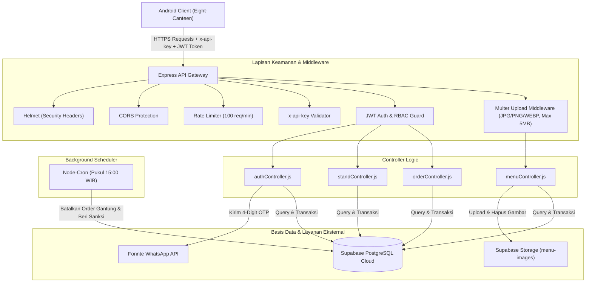

# Eight Canteen - Backend RESTful API (E-Kantin SMKN 8 Jakarta)

<p align="center">
  <strong>High-Performance RESTful API & Real-time Services untuk Ekosistem Kantin Digital SMKN 8 Jakarta</strong>
</p>

<p align="center">
  <a href="https://nodejs.org/"></a>
  <a href="https://expressjs.com/"></a>
  <a href="https://www.docker.com/"></a>
  <a href="https://supabase.com/"></a>
  <a href="https://supabase.com/storage"></a>
  <a href="https://jwt.io/"></a>
  <a href="https://fonnte.com/"></a>
  
</p>

---

## Repository Terhubung

Layanan backend ini dirancang khusus untuk menjadi *backend service* utama bagi aplikasi mobile Android:
* **Frontend Mobile (Android)**: [Eight-Canteen (GitHub)](https://github.com/Papi0404/Eight-Canteen.git)
* **Backend API (Express & Supabase)**: [backend-kantin-mobile (GitHub)](https://github.com/alviangalen/backend-kantin-mobile.git)
* **Instansi**: SMKN 8 Jakarta

---

## Daftar Isi

1. [Tentang Layanan Backend](#tentang-layanan-backend)
2. [Arsitektur Sistem & Alur Data](#arsitektur-sistem--alur-data)
3. [Fitur Utama](#fitur-utama)
4. [Struktur Direktori](#struktur-direktori)
5. [Spesifikasi & Dokumentasi API](#spesifikasi--dokumentasi-api)
   - [Header Wajib](#header-wajib)
   - [Format Respon Standar](#format-respon-standar)
   - [1. Health Check](#1-health-check)
   - [2. Autentikasi & OTP (/api/v1/auth)](#2-autentikasi--otp-apiv1auth)
   - [3. Profil Pengguna (/api/v1/users)](#3-profil-pengguna-apiv1users)
   - [4. Stand & Toko Kantin (/api/v1/stands & /api/v1/seller)](#4-stand--toko-kantin-apiv1stands--apiv1seller)
   - [5. Katalog Menu, Stok & Foto Produk (/api/v1/menus)](#5-katalog-menu-stok--foto-produk-apiv1menus)
   - [6. Pesanan & Checkout (/api/v1/orders)](#6-pesanan--checkout-apiv1orders)
6. [Integrasi dengan Frontend Android](#integrasi-dengan-frontend-android)
7. [Panduan Instalasi & Menjalankan (Docker & Manual)](#panduan-instalasi--menjalankan-docker--manual)
   - [Prasyarat Sistem](#prasyarat-sistem)
   - [Metode 1: Menjalankan dengan Docker Compose (Sangat Direkomendasikan)](#metode-1-menjalankan-dengan-docker-compose-sangat-direkomendasikan)
   - [Mode Pengembangan dengan Docker Compose (Hot-Reload)](#mode-pengembangan-dengan-docker-compose-hot-reload)
   - [NPM Shortcut untuk Docker](#npm-shortcut-untuk-docker)
   - [Metode 2: Menggunakan Docker CLI Standalone](#metode-2-menggunakan-docker-cli-standalone)
   - [Metode 3: Instalasi Tradisional (Node.js & NPM Manual)](#metode-3-instalasi-tradisional-nodejs--npm-manual)
8. [Konfigurasi Environment (.env)](#konfigurasi-environment-env)
9. [Skema Database & Supabase Storage (SQL Editor)](#skema-database--supabase-storage-sql-editor)
10. [Background Cron Job (Patroli Penalti)](#background-cron-job-patroli-penalti)
11. [Deployment ke Cloud (Render)](#deployment-ke-cloud-render)
12. [Tim Pengembang](#tim-pengembang)
13. [Lisensi](#lisensi)

---

## Tentang Layanan Backend

**Eight Canteen Backend API** adalah web service modern berbasis **Node.js** dan **Express.js (v5)** yang terintegrasi dengan **Supabase PostgreSQL** sebagai database utama, **Supabase Storage** untuk hosting foto produk, dan **Fonnte Gateway** untuk pengiriman verifikasi OTP WhatsApp.

Layanan ini mengelola seluruh proses operasional kantin sekolah secara digital:
* **Bebas Antre**: Siswa memesan makanan/minuman langsung dari ponsel pintar.
* **Manajemen Foto Produk**: Penjual dapat mengunggah dan mengelola foto makanan/minuman dengan format yang divalidasi secara ketat (**JPG, JPEG, PNG, WEBP**; maks 5MB) dan disimpan di Supabase Storage.
* **Metode Bayar Ganda**: Mendukung pembayaran non-tunai (QRIS) dan tunai di kasir (CASH).
* **Manajemen Dapur**: Penjual stand menerima notifikasi pesanan masuk, mengelola antrean masak (*COOKING*), hingga menyatakan pesanan siap diambil (*READY_FOR_PICKUP*).
* **Anti Hit & Run**: Pembatalan otomatis dan sanksi pelanggaran (*violation count*) bagi pesanan tunai yang ditinggalkan tanpa pembayaran.
* **Program Loyalitas**: Reward poin belanja bagi siswa yang dapat ditukarkan menjadi potongan harga langsung saat checkout.

---

## Arsitektur Sistem & Alur Data



---

## Fitur Utama

### 1. Autentikasi Passwordless WhatsApp OTP
* Login cepat dan praktis tanpa kata sandi rumit menggunakan nomor WhatsApp.
* Menggunakan layanan **Fonnte WhatsApp API Gateway**.
* Mekanisme normalisasi nomor telepon Indonesia cerdas (mengenali `08...`, `628...`, `+628...`, maupun nomor tanpa awalan).
* Pengiriman 4-digit kode OTP dengan masa kedaluwarsa 5 menit.
* Deteksi otomatis profil pengguna baru (`isNewUser`) untuk diarahkan ke alur pengisian profil.
* Token JWT dengan masa aktif **7 hari**.

### 2. Role-Based Access Control (RBAC)
* **`STUDENT` (Siswa)**: Menjelajahi daftar stand dan menu aktif, checkout pesanan, tukar poin reward, pantau status pesanan & barcode.
* **`SELLER` (Penjual Stand)**: Kelola profil stand, CRUD menu & foto produk, update stok real-time, proses antrean pesanan, dan monitoring omset harian.
* **`ADMIN` (Pengelola Koperasi / Sekolah)**: 
  - **Pendaftaran Terpadu**: Mendaftarkan penjual baru sepaket langsung dengan stan kantinnya (`ownerName`, `standName`, `counterSlot`, `phoneNumber`, `category`).
  - **Manajemen Stand (CRUD Stand)**: Melihat seluruh stand, edit detail stand, atau hapus stand (jika stand dihapus, akun seller tetap aman dan dapat didaftarkan stan baru).
  - **Manajemen Akun Penjual**: Melihat seluruh akun seller beserta stannya, serta menghapus akun penjual (beserta stannya jika diinginkan).
  - **Rekapitulasi Keuangan (Revenue Analytics)**: Memantau omset kotor, omset bersih, biaya koperasi, serta rincian saldo QRIS siap cair dan tunai per masing-masing stand maupun seluruh kantin.
  - **Manajemen Siswa & Suspend Akun**: CRUD data siswa, rekapitulasi kelas, serta kontrol status akun (`is_active`). Akun yang disuspend (`is_active = false`) otomatis **gagal login dan diblokir dari permintaan OTP**, dengan arahan menghubungi admin.
  - **Sanksi Pelanggaran (Violations)**: Melihat daftar siswa pelanggar dan memberikan sanksi poin pelanggaran.

### 3. Upload & Manajemen Foto Produk (CRUD Foto)
* Penjual dapat **mengunggah foto produk langsung saat menambahkan menu** baru (`POST /api/v1/menus` via `multipart/form-data`).
* Tersedia juga endpoint **upload mandiri** (`POST /api/v1/menus/upload-image`) untuk mendapatkan URL publik Supabase Storage sebelum menyimpan menu.
* **Pembaruan Foto Khusus** (`POST/PUT /api/v1/menus/:menuId/image`) untuk mengganti foto produk yang sudah ada secara instan.
* **Penghapusan Foto Khusus** (`DELETE /api/v1/menus/:menuId/image`) untuk mencabut foto dari produk (set `image_url = null`).
* **Validasi Format Ketat**: Hanya mendukung format **JPG, JPEG, PNG, dan WEBP** dengan ukuran maksimal **5 MB**. File tidak valid otomatis ditolak dengan pesan error yang jelas.
* **Pembersihan Otomatis (*Auto Clean-up*)**: Ketika foto produk diganti atau menu dihapus, file gambar lama di Supabase Storage otomatis dihapus untuk mencegah penumpukan file sampah.

### 4. Pemesanan Cerdas, Catatan Kustom & Pengurangan Stok Real-time
* **Catatan Pemesanan (Order Note)**: Siswa dapat menambahkan catatan khusus ke penjual saat checkout (seperti 'Pedas ya bang', 'Es batunya sedikit', 'Jangan pakai daun bawang'), baik pada tingkat pesanan umum maupun per item menu.
* **Pembaruan Catatan**: Catatan dapat diperbarui sebelum pesanan dimasak melalui endpoint `PATCH /api/v1/orders/:orderId/note`.
* Pengecekan stok otomatis sebelum pesanan dibuat (mencegah *overselling*).
* Pengurangan stok menu secara atomik saat checkout berhasil.
* Format nomor pesanan otomatis yang mudah dibedakan:
  - **`Q-XXXX`**: Pesanan pembayaran **QRIS** (Status awal: `PENDING_PAYMENT`).
  - **`C-XXXX`**: Pesanan pembayaran **Tunai di Kasir** (Status awal: `READY_FOR_PICKUP`).

### 5. Sistem Poin Reward & Loyalty
* **Perolehan Poin**: Setiap transaksi kelipatan **Rp 10.000** menghasilkan **1 Poin Reward**.
* **Penukaran Poin**: Siswa dapat menukarkan **20 Poin** untuk mendapatkan potongan harga **Rp 10.000** langsung di halaman checkout (`usePoints: true`).
* Poin reward dikreditkan ke akun siswa secara otomatis ketika pesanan diselesaikan (*COMPLETED*) oleh penjual.

### 6. Patroli Otomatis Anti Hit & Run (Cron Job)
* Sistem menjalankan patroli otomatis setiap hari pukul **15:00 WIB** (`Asia/Jakarta`).
* Pesanan tunai (`CASH`) yang masih berstatus `READY_FOR_PICKUP` hingga sore hari akan otomatis diubah menjadi `CANCELLED`, dan akun siswa dikenakan sanksi dengan menaikkan counter `violation_count` (+1).

### 7. Keamanan & Perlindungan API
* **API Secret Key**: Seluruh endpoint non-healthcheck diwajibkan menyertakan header `x-api-key` yang cocok dengan `APP_SECRET_KEY` server.
* **Rate Limiting**: Dibatasi maksimal **100 permintaan per menit per alamat IP**.
* **Helmet & CORS**: Standar pengamanan HTTP header dan pengawasan akses origin.

---

## Struktur Direktori

```
backend-kantin-mobile/
├── src/
│   ├── config/
│   │   └── database.js          # Inisialisasi Supabase Client SDK
│   ├── controllers/
│   │   ├── authController.js    # Logic OTP WA, verifikasi, registrasi, & profil
│   │   ├── menuController.js    # CRUD menu makanan, upload foto produk, & update stok
│   │   ├── orderController.js   # Checkout, kalkulasi poin, riwayat, status, & pickup
│   │   └── standController.js   # Browse stand, profile stand seller, & rekap omset
│   ├── jobs/
│   │   └── penaltyJob.js        # Scheduled Cron Job (Patroli hit & run pukul 15:00 WIB)
│   ├── middlewares/
│   │   ├── authMiddleware.js    # Verifikasi token JWT & otorisasi role pengguna
│   │   └── uploadMiddleware.js  # Filter validasi foto (JPG, PNG, WEBP) & limit 5MB
│   ├── routes/
│   │   ├── authRoutes.js        # Route /api/v1/auth
│   │   ├── menuRoutes.js        # Route /api/v1/menus (termasuk upload foto produk)
│   │   ├── orderRoutes.js       # Route /api/v1/orders
│   │   ├── standRoutes.js       # Route /api/v1/stands & /api/v1/seller
│   │   └── userRoutes.js        # Route /api/v1/users
│   ├── services/
│   │   ├── storageService.js    # Service upload & hapus foto di Supabase Storage
│   │   └── whatsappService.js   # Service pengiriman OTP via Fonnte API
│   └── server.js                # Server Express, konfigurasi middleware, graceful shutdown, & routing
├── Dockerfile                   # Konfigurasi multi-stage image Docker (Development & Production)
├── docker-compose.yml           # Orkestrasi Docker Compose production-ready
├── docker-compose.dev.yml       # Orkestrasi Docker Compose mode development (hot-reload nodemon)
├── .dockerignore                # Daftar pengecualian file saat proses build Docker
├── .env.example                 # Template konfigurasi environment
├── package.json                 # Dependensi & script eksekusi (express, multer, supabase, docker scripts)
└── render.yaml                  # Konfigurasi deployment web service di Render
```

---

## Spesifikasi & Dokumentasi API

### Header Wajib

Untuk seluruh endpoint API (kecuali healthcheck):
```http
x-api-key: <APP_SECRET_KEY>
```

Untuk endpoint yang membutuhkan autentikasi (Protected):
```http
Authorization: Bearer <JWT_TOKEN>
```

### Format Respon Standar

Format sukses:
```json
{
  "status": "success",
  "message": "Deskripsi pesan (opsional)",
  "data": { ... }
}
```

Format gagal:
```json
{
  "status": "error",
  "message": "Penyebab error"
}
```

---

### 1. Health Check

#### `GET /api/v1/health`
* **Auth**: Bebas
* **Deskripsi**: Cek ketersediaan server dan koneksi aktif ke Supabase PostgreSQL.

---

### 2. Autentikasi & OTP (`/api/v1/auth`)

| Method | Endpoint | Auth | Role | Deskripsi |
|---|---|---|---|---|
| `POST` | `/api/v1/auth/request-otp` | x-api-key | Publik | Meminta 4-digit kode OTP ke WhatsApp |
| `POST` | `/api/v1/auth/verify-otp` | x-api-key | Publik | Verifikasi OTP & mendapatkan token JWT |
| `POST` | `/api/v1/auth/register` | x-api-key / Bearer | Semua | Melengkapi profil akun baru |
| `GET` | `/api/v1/auth/me` | Bearer | Semua | Mengambil profil user yang sedang login |

---

### 3. Profil Pengguna (`/api/v1/users`)

| Method | Endpoint | Auth | Role | Deskripsi |
|---|---|---|---|---|
| `GET` | `/api/v1/users/me` | Bearer | Semua | Ambil detail profil user saat ini |
| `PATCH` / `PUT` | `/api/v1/users/me` | Bearer | Semua | Perbarui nama lengkap, kelas, atau NIS |

---

### 4. Stand & Toko Kantin (`/api/v1/stands` & `/api/v1/seller`)

| Method | Endpoint | Auth | Role | Deskripsi |
|---|---|---|---|---|
| `GET` | `/api/v1/stands` | x-api-key | Publik | Menampilkan daftar seluruh stand kantin |
| `GET` | `/api/v1/stands/me` | Bearer | SELLER | Ambil profil stand milik penjual yang login |
| `PATCH` / `PUT` | `/api/v1/stands/me` | Bearer | SELLER | Update nama stand, nomor counter slot, atau status buka |
| `GET` | `/api/v1/stands/revenue` | Bearer | SELLER, ADMIN | Ambil statistik omset harian & antrean dapur |
| `GET` | `/api/v1/stands/:standId/menus`| x-api-key | Publik | Menampilkan daftar menu milik suatu stand |
| `PATCH` | `/api/v1/stands/:standId` | Bearer | SELLER, ADMIN | Ubah data stand berdasarkan ID |

---

### 5. Katalog Menu, Stok & Foto Produk (`/api/v1/menus`)

| Method | Endpoint | Content-Type | Role | Deskripsi |
|---|---|---|---|---|
| `GET` | `/api/v1/menus` | - | Siswa/Semua | Ambil seluruh menu yang tersedia (`is_available: true`) |
| `GET` | `/api/v1/menus/me` | - | SELLER | Ambil seluruh menu stand penjual (termasuk yang habis) |
| `POST` | `/api/v1/menus/upload-image` | `multipart/form-data` | SELLER, ADMIN | **[BARU]** Upload standalone foto produk ke Supabase Storage |
| `POST` | `/api/v1/menus` | `multipart/form-data` / JSON | SELLER | **[DIPERBARUI]** Tambah menu baru langsung dengan file foto |
| `POST` / `PUT` | `/api/v1/menus/:menuId/image` | `multipart/form-data` | SELLER | **[BARU]** Update/ganti khusus foto pada produk tertentu |
| `DELETE` | `/api/v1/menus/:menuId/image` | - | SELLER | **[BARU]** Hapus foto produk (set `image_url = null`) |
| `PATCH` / `PUT` | `/api/v1/menus/:menuId` | `multipart/form-data` / JSON | SELLER | Update detail menu (bisa sertakan file foto baru) |
| `PATCH` | `/api/v1/menus/:menuId/stock` | `application/json` | SELLER | Update cepat jumlah stok menu |
| `DELETE` | `/api/v1/menus/:menuId` | - | SELLER | Hapus menu beserta file fotonya dari storage |

#### Aturan Upload Foto Produk:
* **Format Diizinkan**: `.jpg`, `.jpeg`, `.png`, `.webp`
* **MIME Types**: `image/jpeg`, `image/jpg`, `image/png`, `image/webp`
* **Ukuran Maksimal**: **5 MB**
* **Nama Form Field**: `image`

---

#### Contoh 1: Upload Standalone Foto Produk (`POST /api/v1/menus/upload-image`)
Form-Data:
* `image`: (Pilih file: `nasi_goreng.jpg`)

*Response (200 OK)*:
```json
{
  "status": "success",
  "message": "Foto produk berhasil diunggah",
  "data": {
    "imageUrl": "https://stbxuavlpwdlyxospvac.supabase.co/storage/v1/object/public/menu-images/menu-1790577646108-371016585.jpg",
    "image_url": "https://stbxuavlpwdlyxospvac.supabase.co/storage/v1/object/public/menu-images/menu-1790577646108-371016585.jpg",
    "fileName": "menu-1790577646108-371016585.jpg"
  }
}
```

---

#### Contoh 2: Tambah Produk Langsung dengan File Foto (`POST /api/v1/menus`)
Content-Type: `multipart/form-data`

Form-Data Fields:
* `name`: `Nasi Goreng Spesial`
* `price`: `15000`
* `stock`: `25`
* `isAvailable`: `true`
* `image`: (File gambar: `nasi_goreng.png`)

*Response (201 Created)*:
```json
{
  "status": "success",
  "message": "Menu berhasil ditambahkan",
  "data": {
    "id": "e4b2d184-b521-4f70-a3ce-8c3e8be0e38a",
    "stand_id": "bf7b8db5-ce1c-4692-9dd9-e2e05d4a64dc",
    "name": "Nasi Goreng Spesial",
    "price": 15000,
    "stock": 25,
    "image_url": "https://stbxuavlpwdlyxospvac.supabase.co/storage/v1/object/public/menu-images/menu-1790577646393-950353598.png",
    "is_available": true,
    "created_at": "2026-09-28T06:40:48.971Z"
  }
}
```

---

#### Contoh 3: Update Khusus Foto Produk (`POST /api/v1/menus/:menuId/image`)
Content-Type: `multipart/form-data`
* `image`: (Pilih file foto baru: `nasi_goreng_hd.webp`)

*Response (200 OK)*:
```json
{
  "status": "success",
  "message": "Foto produk berhasil diperbarui",
  "data": {
    "id": "e4b2d184-b521-4f70-a3ce-8c3e8be0e38a",
    "name": "Nasi Goreng Spesial",
    "price": 15000,
    "stock": 25,
    "image_url": "https://stbxuavlpwdlyxospvac.supabase.co/storage/v1/object/public/menu-images/menu-1790577647363-964771194.jpg",
    "is_available": true
  }
}
```

---

#### Contoh 4: Hapus Khusus Foto Produk (`DELETE /api/v1/menus/:menuId/image`)
*Response (200 OK)*:
```json
{
  "status": "success",
  "message": "Foto produk berhasil dihapus",
  "data": {
    "id": "e4b2d184-b521-4f70-a3ce-8c3e8be0e38a",
    "name": "Nasi Goreng Spesial",
    "price": 15000,
    "stock": 25,
    "image_url": null,
    "is_available": true
  }
}
```

---

### 6. Pesanan & Checkout (`/api/v1/orders`)

| Method | Endpoint | Auth | Role | Deskripsi |
|---|---|---|---|---|
| `POST` | `/api/v1/orders/checkout` | Bearer | STUDENT | Buat pesanan baru dengan catatan kustom (`note`) & kurangi stok otomatis |
| `GET` | `/api/v1/orders` | Bearer | Semua | Riwayat pesanan (menampilkan catatan pesanan umum & per item menu) |
| `GET` | `/api/v1/orders/:orderId` | Bearer | Semua | Detail lengkap pesanan, catatan (`note`), item, dan kode barcode/QR |
| `PATCH` / `PUT` | `/api/v1/orders/:orderId/note` | Bearer | STUDENT, SELLER | **[BARU]** Tambah atau perbarui catatan khusus pesanan |
| `PATCH` / `PUT` | `/api/v1/orders/:orderId/status`| Bearer | SELLER, ADMIN | Perbarui status proses masak/siap diambil |
| `PATCH` | `/api/v1/orders/:orderId/pickup`| Bearer | SELLER, ADMIN | Konfirmasi pesanan selesai (`COMPLETED`) & berikan poin |

---

### 7. Administrasi & Manajemen Kantin (`/api/v1/admin`)

> **Hak Akses**: Wajib menyertakan Token JWT dengan peran **`ADMIN`** dan header `x-api-key`. Pengguna dengan peran `STUDENT` atau `SELLER` akan menerima respon `403 Forbidden`.

#### Ringkasan Endpoint Admin:

| Method | Endpoint | Role | Deskripsi |
|---|---|---|---|
| `POST` | `/api/v1/admin/stands` | ADMIN | **[SEPAKET]** Daftarkan Akun Penjual baru sekaligus Stan Kantinnya |
| `POST` | `/api/v1/admin/sellers` | ADMIN | Alias untuk mendaftarkan Penjual & Stan sepaket |
| `GET` | `/api/v1/admin/stands` | ADMIN | Daftar seluruh stan kantin, pemilik, jumlah menu, dan omset hari ini |
| `GET` | `/api/v1/admin/stands/:standId` | ADMIN | Detail lengkap satu stan kantin beserta seluruh daftar menunya |
| `PATCH` / `PUT` | `/api/v1/admin/stands/:standId` | ADMIN | Perbarui data stan (nama, nomor slot counter, kategori, status buka) |
| `DELETE` | `/api/v1/admin/stands/:standId` | ADMIN | Hapus stan kantin & menunya (**Akun seller tetap tersimpan**) |
| `GET` | `/api/v1/admin/sellers` | ADMIN | Daftar seluruh akun penjual (`SELLER`) beserta stan miliknya |
| `DELETE` | `/api/v1/admin/sellers/:sellerId` | ADMIN | Hapus akun penjual beserta stan miliknya dari sistem |
| `GET` | `/api/v1/admin/revenue` | ADMIN | Rekapitulasi pendapatan seluruh kantin (omset kotor, bersih, potongan koperasi, & performa per stan) |
| `GET` | `/api/v1/admin/revenue/:standId` | ADMIN | Rincian keuangan stand tertentu (saldo QRIS siap cair, saldo kas tunai, total pesanan) |
| `GET` | `/api/v1/admin/students` | ADMIN | Daftar seluruh siswa (mendukung filter `?search=`, `?className=`, `?status=active\|suspended`) |
| `POST` | `/api/v1/admin/students` | ADMIN | Tambah akun siswa baru secara manual |
| `GET` | `/api/v1/admin/students/:studentId` | ADMIN | Detail lengkap satu siswa dan 10 riwayat pesanan terakhir |
| `PATCH` / `PUT` | `/api/v1/admin/students/:studentId` | ADMIN | Perbarui data siswa (nama, NIS, kelas, poin reward, total pelanggaran) |
| `PATCH` | `/api/v1/admin/students/:studentId/status` | ADMIN | **Suspend atau Aktifkan** akun siswa (`isActive: true / false`) |
| `DELETE` | `/api/v1/admin/students/:studentId` | ADMIN | Hapus akun siswa dari sistem |
| `GET` | `/api/v1/admin/classes` | ADMIN | Rekapitulasi daftar kelas dan jumlah siswa terdaftar di setiap kelas |
| `GET` | `/api/v1/admin/violations` | ADMIN | Daftar siswa yang memiliki catatan pelanggaran kantin |
| `POST` | `/api/v1/admin/violations/:userId` | ADMIN | Tambahkan catatan / poin pelanggaran ke siswa |

---

#### Contoh Request & Response Admin:

##### 1. Mendaftarkan Seller & Stand Sepaket (`POST /api/v1/admin/stands`)
* **Header**: `Authorization: Bearer <TOKEN_ADMIN>`, `x-api-key: <KEY>`, `Content-Type: application/json`
* **Request Body**:
```json
{
  "ownerName": "Pak Joko Susanto",
  "standName": "Warung Soto Kudus & Nasi Pecel",
  "phoneNumber": "081298765432",
  "counterSlot": "Stand 03",
  "category": "Makanan"
}
```
* **Response (201 Created)**:
```json
{
  "status": "success",
  "message": "Stand 'Warung Soto Kudus & Nasi Pecel' dan akun penjual 'Pak Joko Susanto' berhasil didaftarkan!",
  "data": {
    "id": "5c4c639b-10b1-4af4-a55d-2e6bfc4913ac",
    "name": "Warung Soto Kudus & Nasi Pecel",
    "standName": "Warung Soto Kudus & Nasi Pecel",
    "counterSlot": "Stand 03",
    "standNumber": "Stand 03",
    "category": "Makanan",
    "isOpen": true,
    "rating": 4.8,
    "ownerId": "6a8fcc35-05d5-4c39-8c0b-9e56b9f215ce",
    "ownerName": "Pak Joko Susanto",
    "ownerPhone": "081298765432",
    "ownerIsActive": true
  }
}
```

##### 2. Rekapitulasi Pendapatan Seluruh Kantin (`GET /api/v1/admin/revenue`)
* **Parameter Opsional**: `?startDate=2026-09-01&endDate=2026-09-30` atau `?period=today`
* **Response (200 OK)**:
```json
{
  "status": "success",
  "data": {
    "grossIncome": 3500000,
    "netIncome": 3325000,
    "koperasiFee": 175000,
    "totalOrders": 142,
    "standsRevenue": [
      {
        "standId": "5c4c639b-10b1-4af4-a55d-2e6bfc4913ac",
        "standName": "Jus Buah Segar Bang Ijul",
        "ownerName": "Bang Ijul",
        "counterSlot": "Stand 01",
        "grossIncome": 2100000,
        "totalOrders": 85,
        "progress": 0.60
      },
      {
        "standId": "8a7c123b-55a1-4ee4-b55d-1e6bfc4919bc",
        "standName": "Ayam Geprek Bu Sri",
        "ownerName": "Bu Sri",
        "counterSlot": "Stand 02",
        "grossIncome": 1400000,
        "totalOrders": 57,
        "progress": 0.40
      }
    ]
  }
}
```

##### 3. Rincian Saldo Siap Cair Per Stand (`GET /api/v1/admin/revenue/:standId`)
* **Response (200 OK)**:
```json
{
  "status": "success",
  "data": {
    "standId": "5c4c639b-10b1-4af4-a55d-2e6bfc4913ac",
    "standName": "Jus Buah Segar Bang Ijul",
    "ownerName": "Bang Ijul",
    "ownerPhone": "0881012343229",
    "accountNumber": "Stand 01",
    "qrisBalance": 750000,
    "cashBalance": 1350000,
    "readyToPayout": 750000,
    "grossIncome": 2100000,
    "totalOrders": 85
  }
}
```

##### 4. Suspend atau Aktifkan Akun Siswa (`PATCH /api/v1/admin/students/:studentId/status`)
* **Request Body (Suspend)**:
```json
{
  "isActive": false
}
```
* **Response (200 OK)**:
```json
{
  "status": "success",
  "message": "Akun siswa 'Galen Alvian' berhasil disuspend (dinonaktifkan).",
  "data": {
    "id": "888423eb-33f2-4afa-a676-dc4ec6cb8558",
    "fullName": "Galen Alvian",
    "phoneNumber": "08773453723432",
    "role": "STUDENT",
    "className": "XII RPL",
    "points": 11,
    "violationCount": 3,
    "isActive": false
  }
}
```
> **Catatan Pencegahan Login**: Ketika akun siswa/pengguna berstatus `is_active = false`, sistem backend otomatis menolak permintaan OTP (`POST /api/v1/auth/request-otp`) dan proses login (`POST /api/v1/auth/verify-otp`) dengan status **`403 Forbidden`**:
> ```json
> {
>   "status": "error",
>   "message": "Akun Anda sedang dinonaktifkan (disuspend). Silakan hubungi pihak admin sekolah atau admin kantin untuk mengaktifkan kembali."
> }
> ```

---

## Integrasi dengan Frontend Android

Frontend mobile [Eight-Canteen](https://github.com/Papi0404/Eight-Canteen.git) menggunakan **Retrofit 2** dan **OkHttp 3 Interceptor** yang dikonfigurasi pada `com.januarzidanetinendeng.eightcanteen.data.remote.ApiConfig`.

### Konfigurasi Multipart Upload di Android Retrofit
Untuk mengunggah gambar dari aplikasi Android:
```kotlin
@Multipart
@POST("menus")
suspend fun createMenuWithImage(
    @Part("name") name: RequestBody,
    @Part("price") price: RequestBody,
    @Part("stock") stock: RequestBody,
    @Part image: MultipartBody.Part?
): BaseResponse<MenuResponse>
```

---

## Panduan Instalasi & Menjalankan (Docker & Manual)

### Prasyarat Sistem
* **Untuk Pengguna Docker (Paling Praktis & Direkomendasikan)**:
  * [Docker](https://www.docker.com/) Engine & [Docker Compose](https://docs.docker.com/compose/) (tersedia di Docker Desktop untuk Windows/macOS atau paket Docker di Linux/WSL).
* **Untuk Pengguna Manual (Tanpa Docker)**:
  * [Node.js](https://nodejs.org/) versi **v18.x** atau **v20.x+** / **v22 LTS**
  * [NPM](https://www.npmjs.com/)
* **Akun & Layanan Eksternal**:
  * Proyek database & storage di [Supabase](https://supabase.com/)
  * Akun dan Device aktif di [Fonnte](https://fonnte.com/) untuk pengiriman WhatsApp OTP

---

### Metode 1: Menjalankan dengan Docker Compose (Sangat Direkomendasikan)

Docker Compose adalah cara paling ringkas dan bebas konfigurasi manual untuk menjalankan backend. Seluruh dependensi, timezone Jakarta, dan runtime terisolasi secara rapi di dalam container.

#### 1. Kloning Repositori
```bash
git clone https://github.com/alviangalen/backend-kantin-mobile.git
cd backend-kantin-mobile
```

#### 2. Konfigurasi Environment (.env)
Salin berkas template environment:
```bash
cp .env.example .env
```
> Buka file `.env` dan sesuaikan kredensial Supabase (`SUPABASE_URL`, `SUPABASE_ANON_KEY`, `SUPABASE_SERVICE_KEY`), token WhatsApp Fonnte, serta secret key aplikasi Anda.

#### 3. Jalankan Container (Production Mode)
Jalankan perintah berikut untuk meng-compile image dan menjalankan container di latar belakang (*detached mode*):
```bash
docker compose up -d --build
```
Layanan backend akan langsung aktif di:
```text
http://localhost:3000
```

#### 4. Memantau Log & Status Container
* Untuk melihat log aktivitas server secara realtime:
  ```bash
  docker compose logs -f
  ```
* Untuk melihat status kesehatan (*health status*) container:
  ```bash
  docker compose ps
  ```

#### 5. Menghentikan Layanan
Untuk menghentikan container backend secara aman (*graceful shutdown*):
```bash
docker compose down
```

---

### Mode Pengembangan dengan Docker Compose (Hot-Reload)

Jika Anda sedang aktif mengembangkan fitur baru dan membutuhkan fitur *hot-reload* (server otomatis restart setiap kali file di folder `src/` disimpan):

```bash
docker compose -f docker-compose.dev.yml up
```

Keunggulan mode ini:
* Folder `src/` lokal terhubung (*bind mount*) langsung ke dalam container.
* Berjalan menggunakan **Nodemon** sehingga proses re-start server instan tanpa perlu rebuild image.

---

### NPM Shortcut untuk Docker

Bagi Anda yang menyukai perintah ringkas via `npm`, telah disediakan script pembantu di `package.json`:

| Perintah | Deskripsi |
|---|---|
| `npm run docker:up` | Menyalakan container backend di background (`docker compose up -d`) |
| `npm run docker:dev` | Menjalankan mode development hot-reload (`docker-compose.dev.yml`) |
| `npm run docker:logs` | Memantau log realtime aplikasi (`docker compose logs -f`) |
| `npm run docker:down` | Menghentikan container (`docker compose down`) |
| `npm run docker:build` | Membangun ulang image Docker (`docker compose build`) |

---

### Metode 2: Menggunakan Docker CLI Standalone

Jika ingin mengoperasikan image Docker secara manual tanpa docker-compose:

1. **Build Docker Image**:
   ```bash
   docker build -t eight-canteen-backend .
   ```

2. **Jalankan Container**:
   ```bash
   docker run -d \
     --name eight-canteen-backend \
     -p 3000:3000 \
     --env-file .env \
     eight-canteen-backend
   ```

3. **Cek Log & Hentikan Container**:
   ```bash
   docker logs -f eight-canteen-backend
   docker stop eight-canteen-backend
   docker rm eight-canteen-backend
   ```

---

### Metode 3: Instalasi Tradisional (Node.js & NPM Manual)

Jika Anda memilih untuk menjalankan backend langsung di sistem operasi tanpa Docker:

1. **Kloning & Install Dependensi**:
   ```bash
   git clone https://github.com/alviangalen/backend-kantin-mobile.git
   cd backend-kantin-mobile
   npm install
   ```

2. **Konfigurasi .env**:
   ```bash
   cp .env.example .env
   ```

3. **Jalankan Aplikasi**:
   * Mode Pengembangan (*Development dengan Nodemon*):
     ```bash
     npm run dev
     ```
   * Mode Produksi (*Production*):
     ```bash
     npm start
     ```

---

## Konfigurasi Environment (.env)

| Variabel | Deskripsi | Contoh |
|---|---|---|
| `PORT` | Port lokal aplikasi Express | `3000` |
| `NODE_ENV` | Lingkungan aplikasi (`development` / `production`) | `development` |
| `SUPABASE_URL` | URL Project API Supabase | `https://xyzcompany.supabase.co` |
| `SUPABASE_ANON_KEY` | Kunci publik Supabase (Anon Key) | `eyJhbGciOiJIUzI1... ` |
| `SUPABASE_SERVICE_KEY` | Kunci Service Role Supabase (akses penuh storage & database) | `eyJhbGciOiJIUzI1... ` |
| `JWT_SECRET` | String acak rahasia tanda tangan token JWT | `super_secret_jwt_key_at_least_32_chars` |
| `APP_SECRET_KEY` | Kunci API rahasia header `x-api-key` | `eight_canteen_secret_2026` |
| `FONNTE_TOKEN` | API Token dari akun Fonnte WhatsApp Gateway | `AbCdEf1234567890` |

---

## Skema Database & Supabase Storage (SQL Editor)

Jalankan seluruh query berikut di menu **SQL Editor** pada dashboard [Supabase](https://supabase.com/) Anda untuk mengaktifkan bucket penyimpanan foto produk beserta kebijakan keamanannya:

```sql
-- =========================================================================
-- SUPABASE SQL EDITOR SCRIPT: STORAGE BUCKET & FOTO PRODUK KANTIN
-- =========================================================================

-- 1. Buat bucket penyimpanan 'menu-images' jika belum ada
INSERT INTO storage.buckets (id, name, public, file_size_limit, allowed_mime_types)
VALUES (
    'menu-images',
    'menu-images',
    true,
    5242880, -- Batas maksimal 5 MB per file
    ARRAY['image/jpeg', 'image/jpg', 'image/png', 'image/webp']
)
ON CONFLICT (id) DO UPDATE SET
    public = true,
    file_size_limit = 5242880,
    allowed_mime_types = ARRAY['image/jpeg', 'image/jpg', 'image/png', 'image/webp'];

-- 2. Kebijakan RLS agar seluruh foto di bucket 'menu-images' dapat dilihat secara publik
DO $$
BEGIN
    IF NOT EXISTS (
        SELECT 1 FROM pg_policies 
        WHERE tablename = 'objects' AND schemaname = 'storage' AND policyname = 'Public Access Menu Images'
    ) THEN
        CREATE POLICY "Public Access Menu Images" 
        ON storage.objects FOR SELECT 
        USING (bucket_id = 'menu-images');
    END IF;
END $$;

-- 3. Kebijakan RLS agar pengguna / service role dapat mengunggah file foto baru
DO $$
BEGIN
    IF NOT EXISTS (
        SELECT 1 FROM pg_policies 
        WHERE tablename = 'objects' AND schemaname = 'storage' AND policyname = 'Allow Upload Menu Images'
    ) THEN
        CREATE POLICY "Allow Upload Menu Images" 
        ON storage.objects FOR INSERT 
        WITH CHECK (bucket_id = 'menu-images');
    END IF;
END $$;

-- 4. Kebijakan RLS agar pengguna / service role dapat memperbarui file foto yang sudah ada
DO $$
BEGIN
    IF NOT EXISTS (
        SELECT 1 FROM pg_policies 
        WHERE tablename = 'objects' AND schemaname = 'storage' AND policyname = 'Allow Update Menu Images'
    ) THEN
        CREATE POLICY "Allow Update Menu Images" 
        ON storage.objects FOR UPDATE 
        USING (bucket_id = 'menu-images');
    END IF;
END $$;

-- 5. Kebijakan RLS agar pengguna / service role dapat menghapus file foto dari bucket
DO $$
BEGIN
    IF NOT EXISTS (
        SELECT 1 FROM pg_policies 
        WHERE tablename = 'objects' AND schemaname = 'storage' AND policyname = 'Allow Delete Menu Images'
    ) THEN
        CREATE POLICY "Allow Delete Menu Images" 
        ON storage.objects FOR DELETE 
        USING (bucket_id = 'menu-images');
    END IF;
END $$;

-- 6. Pastikan kolom image_url pada tabel 'menus' telah tersedia
ALTER TABLE menus ADD COLUMN IF NOT EXISTS image_url TEXT;

-- 7. Tambahkan kolom 'note' untuk catatan pesanan umum & catatan item menu
ALTER TABLE orders ADD COLUMN IF NOT EXISTS note TEXT;
ALTER TABLE order_items ADD COLUMN IF NOT EXISTS note TEXT;

-- 8. [BARU] Tambahkan role 'ADMIN' ke enum user_role jika belum ada
DO $$
BEGIN
    ALTER TYPE user_role ADD VALUE IF NOT EXISTS 'ADMIN';
EXCEPTION
    WHEN duplicate_object THEN null;
END $$;

-- 9. [BARU] Tambahkan kolom 'is_active' pada tabel profiles untuk fitur suspend akun (default TRUE)
ALTER TABLE profiles ADD COLUMN IF NOT EXISTS is_active BOOLEAN DEFAULT TRUE;
UPDATE profiles SET is_active = TRUE WHERE is_active IS NULL;

-- 7. Verifikasi bahwa bucket telah aktif
SELECT id, name, public, file_size_limit, allowed_mime_types 
FROM storage.buckets 
WHERE id = 'menu-images';
```

---

## Background Cron Job (Patroli Penalti)

Layanan ini menyertakan *background worker* otomatis menggunakan **node-cron** (`src/jobs/penaltyJob.js`):

* **Jadwal Eksekusi**: Setiap hari pukul **15:00 WIB** (`0 15 * * *`, timezone: `Asia/Jakarta`).
* **Logika**:
  1. Melakukan query ke database mencari pesanan yang belum diambil:
     `payment_method = 'CASH'` DAN `status = 'READY_FOR_PICKUP'`.
  2. Mengubah status pesanan tersebut menjadi `CANCELLED`.
  3. Mengambil profil siswa pemesan dan menambahkan nilai sanksi `violation_count += 1`.

---

## Deployment ke Cloud (Render)

Layanan ini telah menyertakan berkas konfigurasi `render.yaml`. Langkah deployment:

1. Buka akun [Render.com](https://render.com/).
2. Buat **New Web Service** dan tautkan dengan repositori GitHub: `https://github.com/alviangalen/backend-kantin-mobile.git`.
3. Runtime: `Node`, Build Command: `npm install`, Start Command: `npm start`.
4. Masukkan seluruh variabel yang ada di bagian [Konfigurasi Environment](#konfigurasi-environment-env) ke **Environment Variables** di Render.

---

## Tim Pengembang

* **Abee Maalik Salahudin** - *Project Tester* 
* **Galen Alvian** - *Lead Backend Engineer & API Architect* ([GitHub: @alviangalen](https://github.com/alviangalen))
* **Haikal Rezqi Putra** - *UI/UX Designer* ([GitHub: @Kalllaja](https://github.com/Kalllaja))
* **Januar Zidane Tinendeng** - *Lead Android & Mobile Developer* ([GitHub: @Papi0404](https://github.com/Papi0404))
* **Muhammad Afdhal Al Fairuz** - *Logo Designer* ([GitHub: @MAFDHALALFAIRUZ](https://github.com/MAFDHALALFAIRUZ))
* **Muhammad Alfarezel Arsano** - *UI/UX & Mobile Developer* ([GitHub: @ezelaliluu](https://github.com/ezelaliluu))

* **SMKN 8 Jakarta** - *Mitra Implementasi & Pengguna Utama*

---

## Lisensi

Proyek ini dilisensikan di bawah [ISC License](LICENSE).  
Hak Cipta &copy; 2026 Tim E-Kantin SMKN 8 Jakarta.
